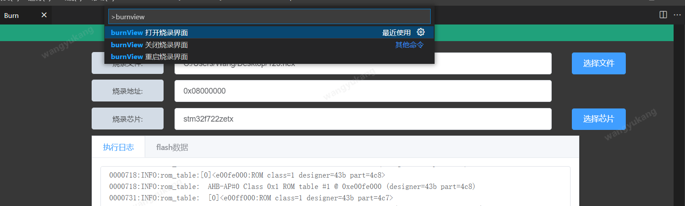
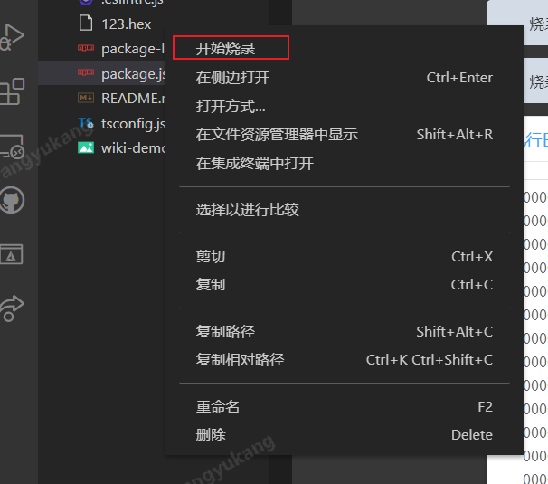
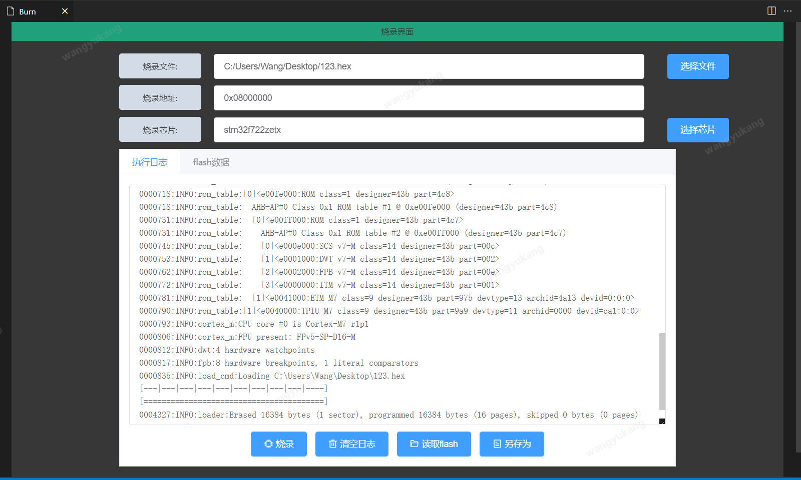

# PuduIde README

vscode插件，已经实现烧录和flash数据读取功能,。

v0.0.1版本中是基于pyocd.exe可执行程序实现，linux/macos版本下，需要替换`./resource/pyocd`下的可执行程序, 后续更新做到兼容全平台....

## Features

## Requirements

If you have any requirements or dependencies, add a section describing those and how to install and configure them.

## Extension Settings

## 

## Release Notes

### 0.0.1

实现了烧录和读取flash功能

-----------------------------------------------------------------------------------------------------------
## Following extension guidelines

## Working with Markdown

windows下按下 ctrl+shift+p , 输入burnView 打开烧录界面:

右键bin/hex 文件,选择开始烧录, 快速进入烧录界面：

### For more information

烧录界面:

**Enjoy!**
